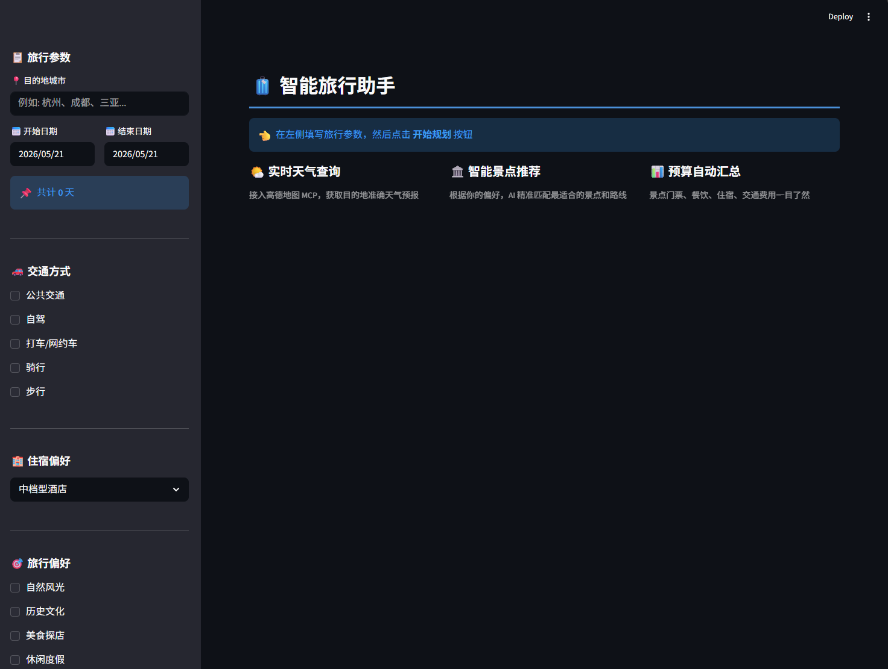
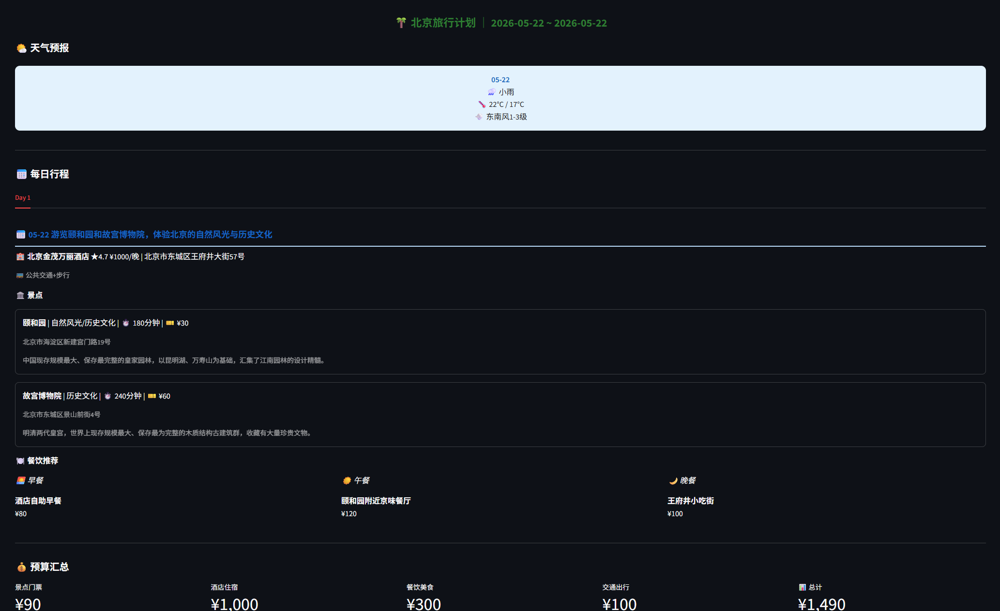

# 🧳 智能旅行助手 (AI Travel Agent)

> 基于 Multi-Agent 架构的智能旅行规划系统，集成高德地图 MCP 服务、RAG 知识库、长期记忆管理和 LangSmith 链路追踪。支持 CLI 和 Web 双界面。

---

## 目录

- [项目概览](#项目概览)
- [系统架构](#系统架构)
- [技术栈](#技术栈)
- [项目结构](#项目结构)
- [核心模块详解](#核心模块详解)
  - [config.py — 配置中心 + Monkey-Patch](#configpy--配置中心--monkey-patch)
  - [mcp_client.py — MCP 连接管理（单例模式）](#mcp_clientpy--mcp-连接管理单例模式)
  - [specialist.py — 领域专家 Agent](#specialistpy--领域专家-agent)
  - [planner.py — 总控编排 Agent](#plannerpy--总控编排-agent)
  - [prompts.py — 提示词中心](#promptspy--提示词中心)
  - [RAG 知识库 — rag_engine.py](#rag-知识库--rag_enginepy)
  - [长期记忆 — memory/](#长期记忆--memory)
  - [链路追踪 — monitor/](#链路追踪--monitor)
  - [render.py — 渲染引擎](#renderpy--渲染引擎)
  - [Agent.py — CLI 入口](#agentpy--cli-入口)
  - [app.py — Web 界面](#apppy--web-界面)
- [数据流全景](#数据流全景)
- [设计模式](#设计模式)
- [快速开始](#快速开始)
- [关键 Bug 修复记录](#关键-bug-修复记录)

---

## 项目概览

本项目实现了一个**多层 Multi-Agent 智能体系统**。用户用自然语言描述旅行需求，系统自动调用高德地图 API 查询天气、搜索景点酒店、规划路线，最终输出结构化的旅行计划 JSON + 格式化可读文本 + 可下载 Markdown。





**核心能力：**

| 能力 | 说明 |
|------|------|
| 📚 RAG 知识库 | 基于 FAISS 向量库，加载 5 座城市旅行攻略文档，提供美食/景点/贴士检索 |
| 🌤️ 天气查询 | 通过高德 MCP `maps_weather` 获取目的地实时天气预报 |
| 🏛️ 景点搜索 | 通过 `maps_text_search` 按城市+偏好搜索 POI |
| 🏨 酒店推荐 | 统一 POI 搜索，按位置推荐附近酒店 |
| 🗺️ 路线规划 | 支持步行/驾车/公交三种方式的路径规划 |
| 📊 预算汇总 | 自动汇总景点门票、酒店、餐饮、交通各项费用 |
| 🧠 长期记忆 | 用户偏好持久化 (SQLite) + 对话历史总结 + 上下文窗口裁剪 |
| 🔍 链路追踪 | 本地 JSONL 日志 + LangSmith 云端可视化双轨追踪 |
| 📥 导出下载 | Web 界面支持 Markdown 格式下载 |

---

## 系统架构

```
┌──────────────────────────────────────────────────────────────┐
│                       用户界面层                              │
│   Agent.py (CLI)              app.py (Streamlit Web)          │
└──────────────┬──────────────────────────┬────────────────────┘
               │                          │
┌──────────────▼──────────────────────────▼────────────────────┐
│                    TripPlanner (总控 Agent)                   │
│                                                              │
│   system_prompt: build_planner_prompt(prefs)  ← 动态注入偏好  │
│   tools: [query_knowledge, search_hotel,                      │
│           search_attraction, query_weather,                   │
│           maps_direction_*]                                   │
│   checkpointer: MemorySaver (LangGraph 状态持久化)            │
│                                                              │
│   职责：接收用户需求 → 编排子 Agent → 整合结果 → JSON          │
└──┬──────────────┬──────────────┬──────────────┬──────────────┘
   │              │              │              │
   ▼              ▼              ▼              ▼
┌──────┐  ┌──────┐  ┌──────┐  ┌──────┐  ┌──────────────────┐
│RAG   │  │Hotel │  │Attrc │  │Weathr│  │ MCP 路线工具      │
│引擎  │  │Agent │  │Agent │  │Agent │  │ walking/driving/  │
│FAISS │  │      │  │      │  │      │  │ transit           │
└──┬───┘  └──┬───┘  └──┬───┘  └──┬───┘  └────────┬─────────┘
   │         │         │         │                 │
   │    ┌────┘    ┌────┘    ┌────┘                 │
   ▼    ▼         ▼         ▼                      │
┌──────────────────────────────────────────────────▼──────────┐
│               McpClientManager (单例)                        │
│   transport: http                                            │
│   url: dashscope.aliyuncs.com/api/v1/mcps/amap-maps/mcp     │
│   ★ 工具按领域分发: poi / weather / route                    │
└──────────────────────┬───────────────────────────────────────┘
                       │
                       ▼
┌──────────────────────────────────────────────────────────────┐
│              阿里百炼 MCP 服务 (高德地图)                      │
│   15 个工具: maps_text_search, maps_weather,                  │
│   maps_direction_*, maps_geo, maps_distance, ...             │
└──────────────────────────────────────────────────────────────┘

┌──────────────────────────────────────────────────────────────┐
│                    监控 & 记忆层                              │
│                                                              │
│  monitor/                     memory/                        │
│  ├── trace.py  → JSONL 日志   ├── store.py    → SQLite 偏好   │
│  └── langsmith_.py → 云端追踪 └── summarizer.py → LLM 总结    │
│                                  └── context.py  → Token 裁剪  │
└──────────────────────────────────────────────────────────────┘
```

**架构特点：**

1. **四层 Agent 嵌套**：Planner (总控) → SpecialistAgent (领域) → MCP Tools (底层 API) + RAG 知识库
2. **子 Agent 作为 Tool**：Hotel/Attraction/Weather Agent 被 `@tool` 装饰器包装，对 Planner 透明
3. **混合工具来源**：Planner 的工具来自 RAG 引擎 + 子 Agent 包装 + 直接 MCP 路线工具
4. **双轨可观测性**：本地 JSONL 日志 (monitor/trace.py) + LangSmith 云端 Dashboard (monitor/langsmith_.py)

---

## 技术栈

| 层级 | 技术 | 用途 |
|------|------|------|
| LLM | 通义千问 (qwen3-max) | 推理与生成，通过阿里百炼 DashScope API 调用 |
| Agent 框架 | LangChain + LangGraph | Agent 创建、工具编排、ReAct 循环、MemorySaver 状态持久化 |
| LLM 集成 | langchain_community.ChatTongyi | 通义千问的 LangChain 适配器 |
| MCP 协议 | langchain_mcp_adapters | MCP 客户端，连接高德地图服务 |
| RAG 知识库 | FAISS + text-embedding-v3 | 向量检索，本地旅行攻略文档语义搜索 |
| Web 界面 | Streamlit | 声明式 Web UI，侧边栏 + 主区域布局 |
| 配置管理 | python-dotenv | .env 环境变量加载 |
| 长期记忆 | SQLite | 用户偏好 + 对话历史 + 会话摘要持久化 |
| 链路追踪 | LangSmith + JSONL | 云端可视化 + 本地日志双轨追踪 |
| 运行环境 | Python 3.12+ | 异步 (asyncio)、类型注解 (PEP 604) |

---

## 项目结构

```
travel-agent/
├── __init__.py
├── config.py                    # 配置中心：API Key、模型、MCP、RAG、Memory、LangSmith
├── mcp/
│   ├── mcp_client.py            # MCP 客户端管理器（单例模式）
│   ├── network_diagnose.py      # MCP 网络诊断工具
│   └── text_mcp.py              # 纯文本 MCP 测试
├── agents/
│   ├── planner.py               # 总控 Agent：编排 + MemorySaver + 偏好注入 + LangSmith
│   ├── specialist.py            # 领域专家 Agent：POI/天气/酒店
│   ├── prompts.py               # 5 个 System Prompt + 动态偏好模板
│   └── agent.py                 # CLI 入口（支持 --demo-memory 等参数）
├── rag/
│   └── rag_engine.py            # RAG 引擎：文档加载 → 切分 → FAISS 向量化 → 检索
├── memory/
│   ├── store.py                 # 用户偏好 Store (SQLite CRUD)
│   ├── summarizer.py            # 对话总结器 (LLM 结构化提取偏好)
│   └── context.py               # 上下文管理 (Token 估算 + 消息裁剪)
├── monitor/
│   ├── trace.py                 # 自建链路追踪 (TraceContext + Span → JSONL)
│   └── langsmith_.py            # LangSmith 集成 (RunTree + Metadata 注入)
├── knowledge/                   # RAG 知识库文档
│   ├── 杭州旅行攻略.md
│   ├── 北京旅行攻略.md
│   ├── 成都旅行攻略.md
│   ├── 上海旅行攻略.md
│   └── 旅行通用贴士.md
├── render.py                    # 渲染引擎：JSON 解析 + CLI 格式化
├── app.py                       # Streamlit Web 入口（含记忆侧边栏）
├── vectorstore/                 # FAISS 向量库存储目录（自动生成）
├── data/
│   └── memory.db                # 长期记忆 SQLite 数据库（自动生成）
└── logs/
    └── trace.jsonl              # 链路追踪 JSONL 日志（自动生成）
```

---

## 核心模块详解

### config.py — 配置中心 + Monkey-Patch

**职责：** 全局配置单例 + 修复 langchain_community 的流式 tool_calls bug。

**设计要点：**

- **`@dataclass`** 定义 `Config` 类，模块级 `CONFIG` 实例作为单例
- `tool_domains` 字典实现**工具领域映射**：将 15 个 MCP 工具按功能分为 poi/weather/route 三组
- `__post_init__` 自动校验 `DASHSCOPE_API_KEY` 是否设置
- `create_llm()` 工厂方法统一创建 `ChatTongyi` 实例，`streaming=True` 启用流式输出
- 集中管理 RAG 参数（chunk_size=500, chunk_overlap=80, top_k=5）、Memory 参数（db_path, max_input_tokens, summarize_threshold）、LangSmith 参数（api_key, project, endpoint）

**Monkey-Patch：** 修复 `langchain_community` 的 `ChatTongyi.subtract_client_response()` 在处理流式 tool_calls 增量时的 `KeyError: 'name'` bug。在 `_patched_subtract()` 中添加 `"name" in prev_function` 和 `"arguments" in prev_function` 守卫条件。

---

### mcp_client.py — MCP 连接管理（单例模式）

**职责：** 管理与阿里百炼高德地图 MCP 服务器的生命周期，按领域分发工具。

**设计模式：单例模式（`__new__` + `_initialized` 标志）**

- **双重单例保护**：`_instance` (类变量) 确保 `__new__` 返回同一对象；`_initialized` (实例变量) 确保 `__init__` 只执行一次
- **MCP 连接配置**：通过 `transport: "http"` 连接到阿里百炼托管的 MCP 服务器，认证头为 `Bearer {DASHSCOPE_API_KEY}`
- **工具缓存**：`_tools_cache` 字典按 key 缓存，全量工具只请求一次

---

### specialist.py — 领域专家 Agent

**职责：** 封装单一职责的 ReAct Agent，专门处理 POI 搜索或天气查询。每个 SpecialistAgent 是一个**独立的 LangGraph Agent**，有自己的 system_prompt 和受限的工具集。遵循**最小权限原则**，防止 Agent 误用不属于自己领域的工具。

---

### planner.py — 总控编排 Agent

**职责：** 这是整个系统的核心。TripPlanner 完成：加载 MCP 工具 → 创建子 Agent → 加载用户记忆 → 动态构建 system prompt → 创建 Planner Agent (含 MemorySaver checkpointer) → 执行流式输出 → 保存对话 & 触发总结。

**v3 核心特性：**

| 特性 | 实现方式 |
|------|---------|
| LangGraph Memory | `create_agent(checkpointer=MemorySaver())`，thread_id 绑定 session |
| 偏好注入 | `build_planner_prompt(prefs_text)` 动态生成 system prompt |
| 上下文裁剪 | ContextManager 估算 Token + 保留最近 N 轮 + 历史摘要注入 |
| 对话持久化 | 每次 stream() 结束后自动保存 user/assistant 消息到 SQLite |
| 自动总结 | 当对话 Token 超阈值时调用 LLM 总结并提取用户偏好 |
| LangSmith 追踪 | 创建 Root RunTree + 注入 metadata (user_id, session_id, model) 到 agent_config |

**子 Agent 作为 Tool 的设计：** 通过 `@tool` 装饰器将 SpecialistAgent 的 `invoke()` 封装为异步函数，Planner 看到的就是 "黑盒工具"——不需要知道内部也是一个 Agent。

**stream() 的事件处理：**

| 事件类型 | 处理方式 |
|---------|---------|
| `on_chat_model_stream` | 过滤 `[TOOL_CALL:...]` 模式 → yield 纯文本 token |
| `on_tool_start` | 映射到 `TOOL_LABELS` 中文标签 → yield 状态行 + 创建 Span |
| `on_tool_end` | 结束 Span，静默（不输出到界面） |

---

### prompts.py — 提示词中心

集中管理 5 个 System Prompt + 动态偏好模板：

| 变量 | 目标 Agent | 核心指令 |
|------|-----------|---------|
| `WEATHER_AGENT_PROMPT` | WeatherAgent | 必须使用 `maps_weather` 工具 |
| `ATTRACTION_AGENT_PROMPT` | AttractionAgent | 必须使用 `maps_text_search` 搜索景点 |
| `HOTEL_AGENT_PROMPT` | HotelAgent | 使用 `maps_text_search` 搜索酒店 |
| `PLANNER_AGENT_PROMPT_TEMPLATE` | TripPlanner | 含 `{user_preferences}` 占位符的模板 |
| `PLANNER_AGENT_PROMPT` | TripPlanner | 向后兼容的默认 Prompt（无偏好） |

`build_planner_prompt(prefs_text)` 动态构建系统提示词，当有用户长期偏好时自动注入 `## 用户长期偏好` 区块。

---

### RAG 知识库 — rag_engine.py

基于 FAISS 向量库 + 通义千问 text-embedding-v3 的本地知识检索系统：

```
knowledge/*.md  →  TextLoader  →  RecursiveCharacterTextSplitter
                                        ↓
                                  chunks (size=500, overlap=80)
                                        ↓
                                  DashScopeEmbeddings
                                        ↓
                                  FAISS 向量库 (vectorstore/)
                                        ↓
                              search_knowledge(query) → Top-K 文档块
```

**关键参数：**
- `chunk_size=500` / `chunk_overlap=80`
- `top_k=5` / `score_threshold=0.3`
- 支持 `force_rebuild` 强制重建

---

### 长期记忆 — memory/

三个子模块组成完整的用户记忆管理：

| 模块 | 文件 | 职责 |
|------|------|------|
| **偏好存储** | `store.py` | SQLite 持久化：user_profiles (偏好 JSON) + conversations (对话历史) + session_summaries (会话摘要) |
| **对话总结** | `summarizer.py` | LLM 驱动的结构化总结：提取预算、交通、住宿、兴趣、旅行风格等偏好 |
| **上下文管理** | `context.py` | Token 估算 (~2 chars/token) + 消息裁剪 (保留 system + 最近 N 轮 + 摘要) |

**UserPreferences 结构：**
```python
@dataclass
class UserPreferences:
    budget_level: str = "中等"           # 经济 / 中等 / 豪华
    transport: List[str]                 # ["自驾", "公共交通"]
    hotel_type: str                      # "豪华型酒店" / "民宿/客栈"
    interests: List[str]                 # ["美食探店", "自然风光"]
    travel_style: str                    # "悠闲" / "紧凑" / "深度游"
    favorite_cities: List[str]           # 常去城市
    special_requirements: str            # 特殊要求
```

**使用方式：**
```bash
# CLI 演示记忆功能（连续两轮对话，第二轮自动加载偏好）
python agents/agent.py --demo-memory

# 指定 user_id 启用记忆
python agents/agent.py --user-id user_001
```

---

### 链路追踪 — monitor/

双轨可观测性：

| 轨道 | 文件 | 存储 | 用途 |
|------|------|------|------|
| **本地 JSONL** | `trace.py` | `logs/trace.jsonl` | TraceContext + Span 记录每次请求的工具调用耗时 |
| **LangSmith** | `langsmith_.py` | LangSmith 云端 | 自动采集 LLM/Tool/Agent 节点，Dashboard 可视化 |

**本地 Trace 输出格式：**
```jsonl
{"type":"span","trace_id":"uuid","span_id":"uuid","name":"search_hotel","duration_ms":1234,...}
{"type":"trace_summary","trace_id":"uuid","total_ms":5678,"span_count":7,...}
```

**LangSmith 启用方式：** 在 `.env` 中设置 `LANGSMITH_ENABLED=true` 和 `LANGCHAIN_API_KEY=lsv2_pt_xxx`，启动时自动初始化。未配置时静默跳过，不影响主流程。

---

### render.py — 渲染引擎

将 Planner 输出的 JSON 字符串转换为可视化格式：
- **`parse_plan(text)`**：从混合文本中提取 JSON，容错处理
- **`format_plan_cli(text)`**：终端友好格式——Unicode 边框、天气图标映射、每日行程缩进、预算汇总对齐
- **`_weather_icon(weather)`**：天气文字→emoji 映射

---

### Agent.py — CLI 入口

```bash
# 用法
python agents/agent.py                      # 流式输出（默认）
python agents/agent.py --no-stream          # 非流式输出
python agents/agent.py --build-rag          # 仅重建 RAG 知识库
python agents/agent.py --user-id user_001   # 启用长期记忆
python agents/agent.py --demo-memory        # 演示长期记忆（两轮对话）
```

---

### app.py — Web 界面

**布局设计：**

```
┌────────────────────┬───────────────────────────────────────┐
│     侧边栏          │          主区域                        │
│                     │                                       │
│ 🧠 长期记忆状态     │  🧳 智能旅行助手                       │
│ 📋 旅行参数        │                                       │
│ 📍 目的地          │  [未开始: 功能介绍]                     │
│ 📅 日期范围        │  [规划后: 格式化旅行计划]               │
│ 🚗 交通方式        │    🌤️ 天气卡片                        │
│ 🏨 住宿偏好        │    📅 每日行程 (Tabs)                  │
│ 🎯 旅行偏好        │    💰 预算汇总 (Metrics)               │
│ 💬 额外要求        │    💡 旅行建议                         │
│ [🚀 开始规划]      │    📥 下载 Markdown                    │
└────────────────────┴───────────────────────────────────────┘
```

**关键技术点：**

- **`@st.cache_resource`**：缓存 TripPlanner 实例，避免每次点击按钮都重新创建 LLM 和 MCP 连接
- **`st.session_state`**：存储 `plan_data`、`plan_raw`、`user_id`（持久化用户标识），使规划结果和记忆在多次 rerun 间持久化
- **记忆侧边栏**：自动检测并展示已存储的用户偏好（兴趣、交通、住宿、预算），使用绿色 badge 样式
- **`asyncio.run(_collect())`**：将异步的 `planner.stream(user_id=user_id)` 转换为同步调用
- **`st.rerun()`**：提交后存储结果到 session_state，rerun 触发展示
- **`st.tabs()` + `st.metric()`**：每日行程 Tab 切换 + 5 列 metric 预算卡片

---

## 数据流全景

```
用户输入自然语言 (Web 表单 或 CLI)
      │
      ▼
┌─────────────────────────────────────────────┐
│  [Memory] 加载长期记忆                       │
│  UserProfileStore.get_preferences(user_id)   │
│  → preferences_text + history_summaries      │
└────────────────────┬────────────────────────┘
                     │
                     ▼
┌─────────────────────────────────────────────┐
│  build_planner_prompt(prefs_text)            │
│  动态注入偏好到 system prompt                │
└────────────────────┬────────────────────────┘
                     │
                     ▼
┌─────────────────────────────────────────────┐
│  TripPlanner.stream(user_id, session_id)     │
│                                              │
│  [LangSmith] Root RunTree + metadata         │
│  [Trace]     TraceContext + Span             │
│                                              │
│  Agent 工具调用链路:                          │
│  ├── query_knowledge  → RAG FAISS 检索       │
│  ├── query_weather    → WeatherAgent → MCP   │
│  ├── search_hotel     → HotelAgent → MCP     │
│  ├── search_attraction → AttractionAgent → MCP│
│  └── maps_direction_* → MCP 路线工具          │
│                                              │
│  逐 token yield (过滤 TOOL_CALL 泄漏)         │
└────────────────┬────────────────────────────┘
                 │
    ┌────────────┴────────────┐
    ▼                         ▼
┌──────────┐          ┌──────────────┐
│ [Memory] │          │ [Monitor]    │
│ 保存对话  │          │ end_trace()  │
│ 触发总结  │          │ JSONL 日志   │
└──────────┘          └──────────────┘
                 │
                 ▼
┌─────────────────────────────────────────────┐
│  render.py                                   │
│  parse_plan() → JSON → format_plan_cli()     │
│  或 st.markdown + CSS (Web)                  │
└─────────────────────────────────────────────┘
```

---

## 设计模式

| 模式 | 应用位置 | 说明 |
|------|---------|------|
| **单例模式** | `McpClientManager`、`RagEngine`、`UserProfileStore` | 全局唯一实例，避免重复初始化 |
| **工厂方法** | `Config.create_llm()`、`Config.create_embeddings()` | 统一创建 LLM/Embedding 实例 |
| **门面模式** | `TripPlanner` | 对外暴露简单的 `stream()/invoke()`，隐藏内部复杂性 |
| **装饰器模式** | `@tool` 包装子 Agent | 将 SpecialistAgent 适配为 LangChain Tool 接口 |
| **策略模式** | `tool_domains` 字典、`ContextManager.prepare()` | 工具按领域分组；消息裁剪可替换策略 |
| **模板方法** | `SpecialistAgent.build()`、`UserPreferences.merge()` | 子类可覆盖构建逻辑；偏好合并算法 |
| **适配器模式** | `render.py`、`build_planner_prompt()` | JSON→CLI/Web 双视图；偏好→Prompt 文本 |

---

## 快速开始

### 1. 环境准备

```bash
# 创建虚拟环境
conda create -n Agent python=3.12
conda activate Agent

# 安装依赖
pip install langchain langchain-community langchain-mcp-adapters
pip install streamlit python-dotenv dashscope
pip install faiss-cpu langsmith
```

### 2. 配置 API Key

在项目根目录创建 `.env` 文件：

```env
# 必填：阿里百炼 API Key
DASHSCOPE_API_KEY=your_dashscope_api_key_here

# 可选：LangSmith 追踪（未配置则自动跳过）
LANGSMITH_ENABLED=true
LANGCHAIN_API_KEY=lsv2_pt_your_langsmith_key
LANGCHAIN_PROJECT=travel-agent
```

> - 阿里百炼 API Key 申请：https://dashscope.console.aliyun.com/
> - 高德地图 MCP 需在百炼控制台手动开通
> - LangSmith 注册：https://smith.langchain.com/

### 3. 构建 RAG 知识库（可选）

```bash
python agents/agent.py --build-rag
```

### 4. 运行

```bash
# CLI 模式
python agents/agent.py

# CLI 模式（演示长期记忆）
python agents/agent.py --demo-memory

# Web 模式
streamlit run app.py
```

---

## 关键 Bug 修复记录

### Bug 1：ChatTongyi 流式 tool_calls 的 KeyError

**症状：** `KeyError: 'name'` at `tongyi.py:606`

**根因：** `langchain_community` 的 `subtract_client_response()` 未对 `prev_function` 做 key 存在性检查

**修复：** [config.py](config.py) — Monkey-patch 添加 key 存在性守卫

### Bug 2：`nonlocal` 作用域错误

**症状：** `SyntaxError: no binding for nonlocal 'full_text' found`

**修复：** `_collect()` 改为只 return 结果，变量处理移到外层同步代码

### Bug 3：天气卡片文字不可见

**症状：** 天气预报卡片区域文字颜色过浅

**修复：** 添加 `color: #1a1a1a` 到 `.weather-card` 和 `.budget-card` CSS

### Bug 4：Prompt 模板 JSON `{}` 与 `.format()` 冲突

**症状：** `KeyError: '\n  "city"'`

**根因：** `PLANNER_AGENT_PROMPT_TEMPLATE` 含 JSON 示例，`{}` 被 `.format()` 误解析

**修复：** 改用 `str.replace("{user_preferences}", ...)` 替代 `.format()`
